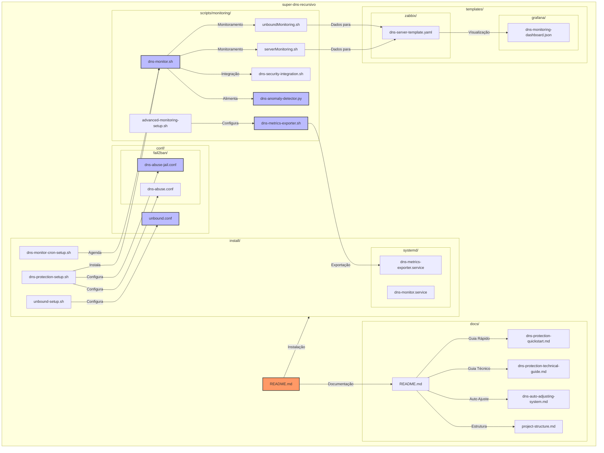
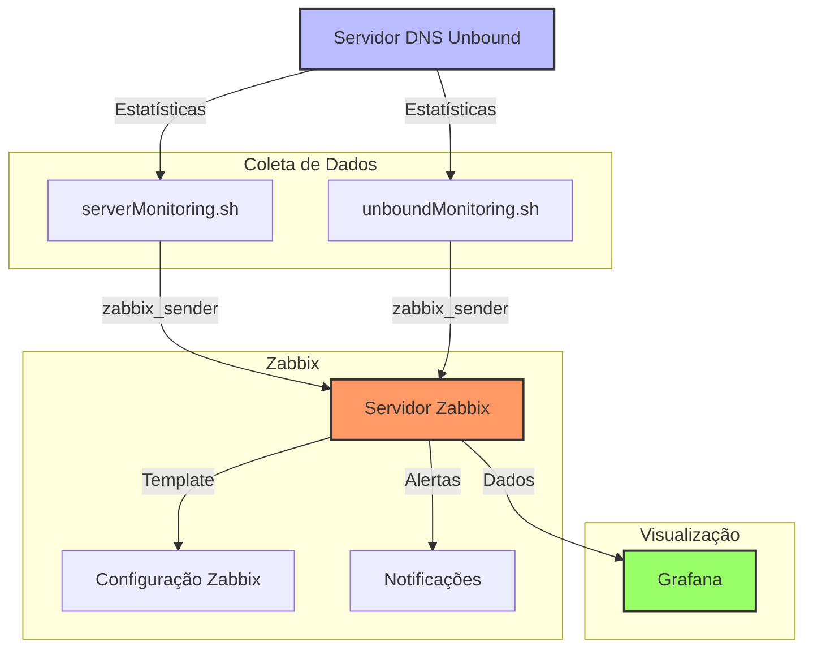

# Super DNS Recursivo - Servidor DNS + Monitoramento + Proteção


Um servidor DNS recursivo completo baseado no Unbound com monitoramento integrado e proteção contra abusos.

## Estrutura do Projeto



## Visão Geral

O Super DNS Recursivo oferece uma solução completa para serviços DNS em provedores de Internet e empresas, com foco em:

- **Alto Desempenho**: Configuração otimizada do Unbound para ambientes corporativos e de ISP
- **Monitoramento Detalhado**: Integração com Zabbix e Grafana para métricas em tempo real
- **Proteção Avançada**: Sistema de detecção e mitigação de ataques e abusos DNS
- **Proteção contra Amplificação**: Mecanismos para evitar que o servidor seja usado em ataques de reflexão DNS
- **Fácil Implantação**: Scripts de instalação automatizados
- **Sistema de Auto-Ajuste**: Adaptação automática a redes de qualquer tamanho

## Plataformas Suportadas

- Ubuntu 20.04 LTS / 22.04 LTS
- Debian 10 / 11 / 12

> Todas as versões foram testadas em instalações limpas e em modo "container" do Proxmox.

## Componentes do Sistema

O sistema é composto por cinco componentes principais:

1. **Servidor DNS Unbound**: Resolvedor DNS recursivo altamente otimizado
2. **Sistema de Monitoramento**: Coleta de métricas com Zabbix e visualização com Grafana
3. **Sistema de Proteção**: Detecção e bloqueio automático de abusos com análise avançada e Fail2ban
4. **Sistema de Auto-Ajuste**: Adaptação automática à escala e características do ambiente
5. **Exportador de Métricas**: Compatível com diferentes sistemas de monitoramento (Prometheus, Zabbix, Grafana)

## Guia de Instalação

### 1. Servidor DNS Unbound

```bash
# Atualizar dependências
sudo apt update && sudo apt upgrade -y

# Instalar componentes necessários
sudo apt install unbound net-tools unbound-anchor wget dnsutils dnstop -y

# Configurar Unbound
cd /etc/unbound
sudo mv unbound.conf unbound.conf.bkp
sudo nano unbound.conf
```

Cole o seguinte conteúdo no arquivo de configuração, ajustando conforme necessário:

```properties
# TriplePlay Network
# Unbound DNS Server V1.0

include: "/etc/unbound/unbound.conf.d/*.conf"

# Habilitar uso do unbound-control
remote-control:
  control-enable: yes

# Configuração do servidor
server:
  # LOGS DE USO - Descomente apenas para debug
  # chroot: ""
  # logfile: /var/log/syslog.log
  # verbosity: 1
  # log-queries: yes

  # Estatísticas de Uso para Monitoramento
  statistics-interval: 0
  extended-statistics: yes
  statistics-cumulative: no
  port: 53
  
  # Lista de Interfaces - configuração para DNS primário e secundário
  interface: 0.0.0.0
  interface: ::0
  interface: 10.10.10.10  # DNS Primário IPv4
  interface: 10.10.9.9    # DNS Secundário IPv4
  interface: fd10:1010::1010  # DNS Primário IPv6
  interface: fd10:1010::9999  # DNS Secundário IPv6
  interface: 127.0.0.1
  interface: ::1

  # Lista de IPs com acesso permitido
  access-control: 127.0.0.1 allow
  access-control: ::1 allow
  access-control: 10.0.0.0/8 allow
  access-control: 100.64.0.0/10 allow
  access-control: 127.0.0.0/8 allow
  access-control: 172.16.0.0/12 allow
  access-control: 192.168.0.0/16 allow

  # Tunning de Desempenho
  num-threads: 4
  msg-cache-slabs: 8
  rrset-cache-slabs: 8
  infra-cache-slabs: 8
  key-cache-slabs: 8
  so-reuseport: yes
  outgoing-range: 200
  rrset-cache-size: 256m
  msg-cache-size: 128m
  cache-min-ttl: 3600
  cache-max-ttl: 10800

  # Protocolos Suportados
  do-ip4: yes
  do-ip6: yes
  do-tcp: yes
  do-udp: yes
  
  # Arquivo de Hints
  root-hints: "/etc/unbound/named.cache"
  
  # Configurações de Segurança
  hide-identity: yes
  hide-version: yes
  harden-glue: yes
  harden-dnssec-stripped: yes
```

Finalize a configuração:

```bash
# Baixar lista de servidores raiz
wget https://www.internic.net/domain/named.cache -O /etc/unbound/named.cache

# Caso esteja usando Ubuntu, desativar o resolver nativo
sudo service systemd-resolved stop
sudo systemctl disable systemd-resolved.service

# Validar, habilitar e iniciar o serviço
sudo unbound-checkconf
sudo systemctl enable unbound
sudo systemctl restart unbound
sudo unbound-control-setup
sudo systemctl restart unbound
sudo unbound-control reload

# Configurar o servidor para usar o DNS local
echo "nameserver 127.0.0.1" | sudo tee /etc/resolv.conf
echo "nameserver ::1" | sudo tee -a /etc/resolv.conf
```

### 2. Sistema de Proteção Contra Abusos

O sistema de proteção monitora o tráfego DNS para identificar e bloquear automaticamente tentativas de abuso, com recursos avançados de detecção e análise.

```bash
# Instalar o sistema de proteção
sudo chmod +x ./install/dns-protection-setup.sh
sudo ./install/dns-protection-setup.sh
```

Este script configura:
- Monitoramento de tráfego DNS com dnstop
- Detecção de requisições abusivas com análise inteligente
- Sistema de whitelist para IPs confiáveis
- Detecção de tunneling DNS através de análise de entropia
- Detecção de ataques baseados em consultas NXDomain
- Alertas precoces antes de atingir limites críticos
- Integração com Fail2ban para bloqueio automático
- Serviço systemd para execução contínua

#### Recursos Avançados de Proteção

##### Análise Automática de Tráfego
```bash
# Analisa o tráfego atual por 5 minutos e sugere configurações ideais
sudo /opt/dns-protection/dns-monitor.sh --analyze
```

##### Configuração Interativa
```bash
# Interface interativa para ajuste de parâmetros
sudo /opt/dns-protection/dns-monitor.sh --config
```

##### Whitelist de IPs Confiáveis

O sistema de proteção inclui um mecanismo de whitelist para garantir que IPs confiáveis nunca sejam bloqueados, mesmo em caso de tráfego anômalo.

```bash
# Editar a lista de IPs e redes confiáveis
sudo nano /opt/dns-protection/config/whitelist.txt
```

Formato do arquivo de whitelist:
```
# Formato: Um IP ou rede por linha (suporta notação CIDR)
# Exemplo:
192.168.1.10       # IP único (servidor interno)
10.0.0.0/24        # Rede interna completa
2001:db8::/64      # Rede IPv6
100.64.0.1         # Outro IP confiável

# Comentários são permitidos após o caractere #
```

Comandos para gerenciar a whitelist:
```bash
# Adicionar um IP à whitelist
sudo /opt/dns-protection/dns-monitor.sh --add-whitelist 192.168.1.100

# Adicionar uma rede à whitelist
sudo /opt/dns-protection/dns-monitor.sh --add-whitelist 172.16.0.0/16

# Remover um IP ou rede da whitelist
sudo /opt/dns-protection/dns-monitor.sh --remove-whitelist 192.168.1.100

# Listar todos os IPs e redes na whitelist
sudo /opt/dns-protection/dns-monitor.sh --list-whitelist
```

**Recomendações para whitelist:**
- Adicione IPs de servidores internos e infraestrutura crítica
- Para NATs corporativos com muitos usuários, adicione o IP público do NAT
- Para provedores, considere adicionar gateways de clientes empresariais
- Adicione servidores de monitoramento e sistemas de gerenciamento
- Considere adicionar IPs de serviços DNS recursivos externos confiáveis

Após modificar a whitelist, reinicie o serviço para aplicar as alterações:
```bash
sudo systemctl restart dns-protection
```

##### Modo de Teste
```bash
# Executa o monitoramento sem banir IPs (útil para ajustar configurações)
sudo /opt/dns-protection/dns-monitor.sh --test
```

Para verificar o status da proteção:
```bash
sudo systemctl status dns-protection
sudo fail2ban-client status dns-abuse
```

### 3. Sistema de Monitoramento



```bash
# Instalar o zabbix-sender para o seu sistema operacional
## Para Debian 10/11/12
sudo wget https://repo.zabbix.com/zabbix/6.4/debian/pool/main/z/zabbix-release/zabbix-release_6.4-1+debian$(lsb_release -rs)_all.deb
sudo dpkg -i zabbix-release_6.4-1+debian$(lsb_release -rs)_all.deb
sudo apt update
sudo apt install zabbix-sender

## Para Ubuntu 20.04/22.04/24.04
sudo wget https://repo.zabbix.com/zabbix/6.4/ubuntu/pool/main/z/zabbix-release/zabbix-release_6.4-1+ubuntu$(lsb_release -rs)_all.deb
sudo dpkg -i zabbix-release_6.4-1+ubuntu$(lsb_release -rs)_all.deb
sudo apt update
sudo apt install zabbix-sender
```

Configurar os scripts de monitoramento:

```bash
# Copiar e configurar os scripts
sudo cp ./scripts/monitoring/*.sh /etc/unbound/
sudo chmod +x /etc/unbound/*.sh

# Configurar o agendamento com cron
sudo crontab -e

# Adicionar as linhas:
*/1 * * * * /etc/unbound/serverMonitoring.sh IP-DO-ZABBIX NOME-DO-HOST-DNS >/dev/null 2>&1
*/3 * * * * /etc/unbound/unboundMonitoring.sh IP-DO-ZABBIX NOME-DO-HOST-DNS >/dev/null 2>&1
```

#### Importação dos Templates

##### Zabbix
1. Acesse seu servidor Zabbix (5.4+)
2. Navegue até **Configuração** > **Templates**
3. Clique em **Importar**
4. Selecione o arquivo `templates/zabbix/dns-server-template.yaml`
5. Confirme a importação

##### Grafana
1. Acesse seu servidor Grafana (10.2.1+)
2. Navegue até **Dashboards** > **Import**
3. Clique em **Upload JSON file**
4. Selecione o arquivo `templates/grafana/dns-monitoring-dashboard.json`
5. Selecione o datasource do Zabbix que contém os dados do servidor DNS
6. Clique em **Import**

### 4. Sistema de Auto-Ajuste

O Super DNS Recursivo inclui um sistema de auto-ajuste que adapta automaticamente suas configurações com base no tráfego real do ambiente, sem necessidade de dimensionamento manual.

```bash
# Instalar componentes adicionais necessários para o auto-ajuste
sudo apt install bc ipcalc conntrack -y

# Analisar o tráfego atual e ajustar configurações automaticamente
sudo scripts/monitoring/dns-monitor.sh --analyze
```

O sistema de auto-ajuste funciona da seguinte forma:

1. **Análise de Tráfego**: Monitoramento do tráfego DNS por 5 minutos para coletar métricas reais
2. **Cálculo de Parâmetros**: Determinação automática de limites ideais para o seu ambiente
3. **Aplicação de Configurações**: Ajuste das configurações para balancear desempenho e proteção
4. **Persistência**: Configurações salvas em `/opt/dns-protection/config/dns-monitor.conf`

#### Parâmetros Ajustáveis

| Parâmetro | Descrição | Ajuste Automático |
|-----------|-----------|-------------------|
| MAX_RPS | Requisições máximas por segundo | Baseado no tráfego máximo detectado |
| MONITOR_INTERVAL | Intervalo de monitoramento | Otimizado para o tamanho da rede |
| ALERT_THRESHOLD | Limite percentual para alertas | Baseado na distribuição do tráfego |
| QUERY_ENTROPY_THRESHOLD | Limite para detecção de tunneling | Ajustado conforme tipos de consultas |
| MAX_NX_DOMAIN_PERCENT | Percentual máximo de NXDomain | Calculado a partir do tráfego real |

Para mais detalhes sobre o sistema de auto-ajuste, consulte `docs/dns-auto-adjusting-system.md`.

### 5. Exportador de Métricas DNS

O sistema inclui um exportador de métricas flexível que permite a integração com diferentes sistemas de monitoramento.

```bash
# Instalar o exportador de métricas como serviço
sudo cp ./install/systemd/dns-metrics-exporter.service /etc/systemd/system/
sudo systemctl daemon-reload
sudo systemctl enable dns-metrics-exporter
sudo systemctl start dns-metrics-exporter
```

#### Formatos de Exportação Suportados

O exportador de métricas suporta três formatos diferentes:

1. **Prometheus**: Gera arquivos de métricas no formato compatível com Prometheus
   ```bash
   sudo scripts/monitoring/dns-metrics-exporter.sh --prometheus
   ```

2. **Zabbix**: Envia métricas diretamente para um servidor Zabbix 
   ```bash
   sudo scripts/monitoring/dns-metrics-exporter.sh --zabbix
   ```

3. **Grafana**: Gera arquivos JSON para importação direta no Grafana
   ```bash
   sudo scripts/monitoring/dns-metrics-exporter.sh --grafana
   ```

#### Métricas Coletadas

- Consultas DNS totais
- IPs únicos realizando consultas
- Taxa máxima de requisições por segundo
- Taxa média de requisições por segundo
- Percentual de consultas NXDomain
- Número de IPs bloqueados

### 6. Detector de Anomalias DNS

O sistema inclui um detector de anomalias baseado em Python que utiliza técnicas avançadas para identificar padrões anormais no tráfego DNS.

```bash
# Instalar dependências do detector de anomalias
sudo apt install python3-pip -y
sudo pip3 install numpy pandas scikit-learn

# Executar o detector de anomalias manualmente
sudo python3 scripts/monitoring/dns-anomaly-detector.py
```

O detector de anomalias utiliza algoritmos de aprendizado de máquina para:

1. **Detecção de Padrões**: Identificar consultas DNS anormais que não seguem padrões usuais
2. **Análise de Frequência**: Detectar mudanças repentinas na frequência ou volume de consultas
3. **Análise de Entropia**: Identificar consultas potencialmente maliciosas com base em entropia
4. **Correlação**: Relacionar atividades suspeitas entre diferentes hosts

O detector de anomalias trabalha em conjunto com o sistema de proteção para proporcionar uma camada adicional de segurança contra ameaças avançadas.

## Verificação e Solução de Problemas

### Verificar Status dos Serviços
```bash
# Status do servidor DNS
systemctl status unbound

# Status da proteção contra abusos
systemctl status dns-protection

# Listar IPs bloqueados
fail2ban-client status dns-abuse

# Visualizar logs do sistema de proteção
tail -f /var/log/dns-abuse.log
```

### Verificar Funcionamento do DNS
```bash
# Testar resolução de nomes
dig @127.0.0.1 google.com

# Verificar estatísticas do servidor
unbound-control stats
```

### Problemas Comuns

| Problema | Solução |
|----------|---------|
| Falha na inicialização do Unbound | Verifique erros em `/var/log/syslog` ou execute `unbound-checkconf` |
| Alto uso de CPU | Ajuste o valor de `num-threads` de acordo com o número de CPUs |
| Baixo desempenho de cache | Aumente os valores de `rrset-cache-size` e `msg-cache-size` |
| Falsos positivos no sistema de proteção | Use `/opt/dns-protection/dns-monitor.sh --analyze` para encontrar configurações ideais ou adicione IPs à whitelist |
| Bloqueio de clientes legítimos | Adicione seus IPs confiáveis em `/opt/dns-protection/config/whitelist.txt` |

## Documentação Adicional

Para informações mais detalhadas sobre o sistema de proteção DNS, consulte:

- **Guia Rápido**: `docs/dns-protection-quickstart.md`
- **Guia Técnico**: `docs/dns-protection-technical-guide.md`
- **Sistema de Auto-Ajuste**: `docs/dns-auto-adjusting-system.md`
- **Estrutura do Projeto**: `docs/project-structure.md`

## Licença

Este projeto está licenciado sob a licença MIT - veja o arquivo LICENSE.md para detalhes.

## Créditos

Desenvolvido pela TriplePlay Network - [www.tripleplay.network](https://www.tripleplay.network)