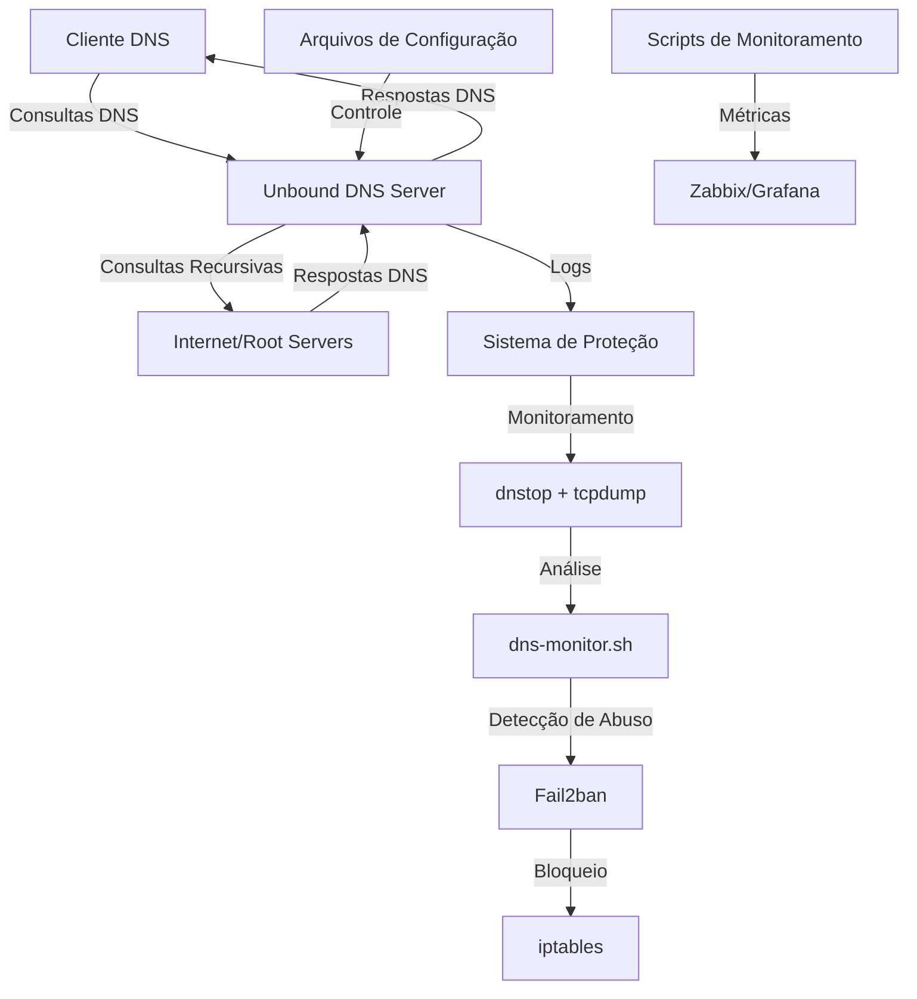

# Documentação do Super DNS Recursivo

> **Nota**: Esta documentação é complementar ao [README principal](../README.md) do projeto. Consulte o README principal para a visão geral e instruções básicas de instalação.

Este diretório contém a documentação detalhada para instalação, configuração e manutenção do servidor Super DNS Recursivo, incluindo o sistema de proteção contra abusos.

## Índice de Documentação

1. [Guia de Início Rápido](dns-protection-quickstart.md) - Instruções rápidas para iniciar o sistema
2. [Guia Técnico Completo](dns-protection-technical-guide.md) - Documentação técnica detalhada
3. [Sistema de Auto-Ajuste](dns-auto-adjusting-system.md) - Como funciona o sistema de auto-ajuste
4. [Estrutura do Projeto](project-structure.md) - Organização de arquivos e diretórios

## Arquitetura do Sistema

## Solução de Problemas

Para problemas comuns e suas soluções, consulte a [seção de Verificação e Solução de Problemas](../README.md#verificação-e-solução-de-problemas) no README principal.