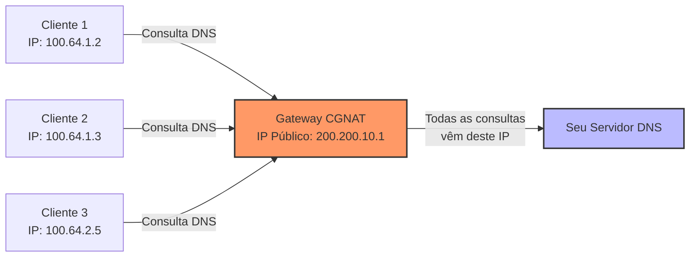

# Configuração de Whitelist para CGNAT

Em ambientes de ISP que utilizam CGNAT (Carrier-Grade NAT), é importante compreender como configurar corretamente a whitelist para prevenir falsos positivos de bloqueio.

## O que é CGNAT?

CGNAT (Carrier-Grade NAT) é uma técnica utilizada por provedores de internet para compartilhar um único endereço IP público entre múltiplos clientes, geralmente utilizando os blocos de IP privados:
- 100.64.0.0/10 (Espaço oficialmente dedicado para CGNAT)
- 10.0.0.0/8 (Também amplamente utilizado)

## Como funciona o tráfego DNS com CGNAT



## Configuração Correta da Whitelist

Para configurar corretamente a whitelist em ambientes com CGNAT:

1. **Adicione o IP público do gateway CGNAT** à whitelist, não os IPs privados dos clientes. 
   
   ```bash
   # Exemplo de whitelist.txt
   200.200.10.1      # Gateway CGNAT região Norte
   200.200.20.1      # Gateway CGNAT região Sul
   ```

2. **Considere os limites de tráfego** - Um gateway CGNAT pode gerar um volume muito alto de consultas legítimas.

3. **Monitore os gateways CGNAT** separadamente para detectar comportamentos anômalos específicos.

4. **Considere usar rate-limiting em vez de bloqueio** - Para gateways CGNAT, pode ser melhor limitar a taxa de requisições do que bloquear completamente:

   ```bash
   # Adicionar um gateway CGNAT à lista de rate limiting
   sudo /opt/dns-protection/dns-monitor.sh --add-rate-limit 200.200.10.1
   ```

## Identificando IPs Públicos de CGNAT

Para identificar os IPs públicos dos seus gateways CGNAT:

1. Consulte a documentação de sua infraestrutura de rede
2. Verifique a configuração dos equipamentos que realizam CGNAT
3. Use a ferramenta `iptables` com o comando `conntrack` para visualizar as conexões NAT ativas

```bash
# Verificar conexões NAT ativas
sudo conntrack -L | grep 53
```

## Otimização para Grandes Volumes de Tráfego

Para provedores com muitos clientes atrás de CGNAT:

1. Aumente os valores de `MAX_RPS` para os IPs públicos dos gateways CGNAT
2. Use o modo de análise para determinar o tráfego DNS normal esperado:

```bash
sudo /opt/dns-protection/dns-monitor.sh --analyze
```

3. Considere implementar servidores DNS recursivos distribuídos geograficamente para balancear a carga