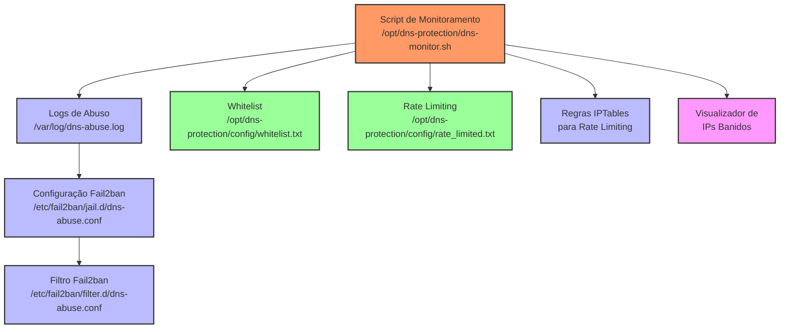
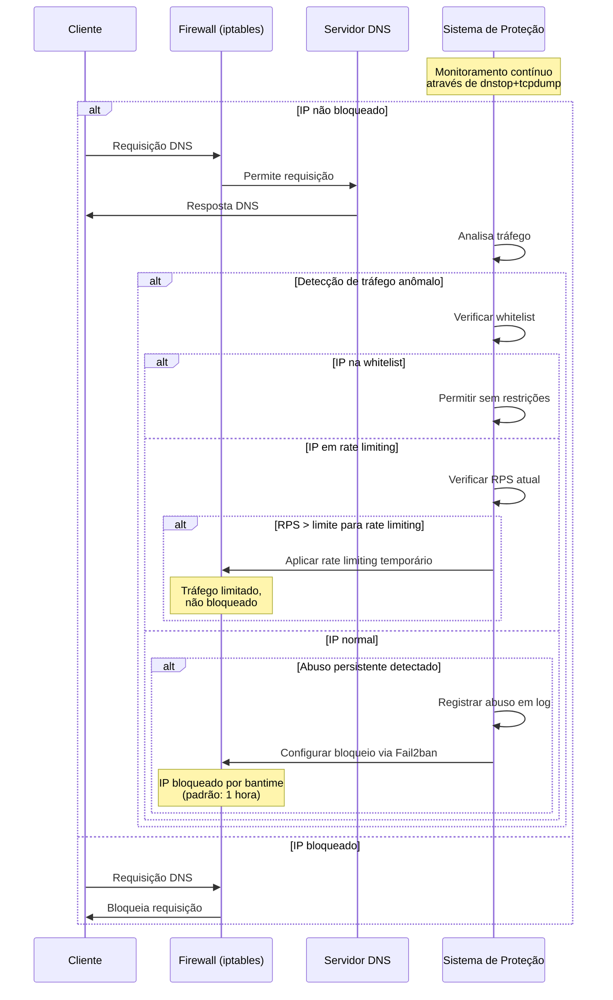

# Guia Rápido de Implementação: Proteção DNS com dnstop e Fail2ban

Este guia apresenta o procedimento simplificado para implementar a proteção do servidor DNS Unbound contra abusos, utilizando dntop para monitoramento e Fail2ban para bloqueio automático.

## Fluxo de Instalação


## Instalação em 4 Passos

### 1. Verificar Pré-requisitos

Certifique-se de que o Unbound está corretamente instalado e funcionando:

```bash
systemctl status unbound
```

### 2. Instalar Script de Proteção

```bash
# Baixar o script (se necessário) para o diretório atual
# git clone https://github.com/flicl/super-dns-recursivo.git
# cd seu-repositorio

# Tornar executável
chmod +x dns-protection-setup.sh

# Executar instalação (necessário privilégios de root)
sudo ./dns-protection-setup.sh
```

### 3. Verificar Instalação

```bash
# Verificar o status do serviço de proteção
sudo systemctl status dns-protection

# Verificar configuração do Fail2ban
sudo fail2ban-client status dns-abuse
```

### 4. Personalizar (Opcional)

Ajuste os parâmetros principais conforme necessário:

- **Análise e configuração automática**: Execute `sudo /opt/dns-protection/dns-monitor.sh --analyze` para avaliar o tráfego e receber recomendações de configuração
- **Configuração interativa**: Execute `sudo /opt/dns-protection/dns-monitor.sh --config` para ajustar parâmetros interativamente
- **Lista de IPs confiáveis**: Edite o arquivo `/opt/dns-protection/config/whitelist.txt` para adicionar IPs e redes que nunca devem ser bloqueados
- **Lista de rate limiting**: Edite o arquivo `/opt/dns-protection/config/rate_limited.txt` para adicionar IPs de clientes que devem ter tráfego limitado em vez de bloqueado

## Novos Recursos de Proteção DNS

### Rate Limiting para Clientes Legítimos

Em vez de bloquear completamente um cliente legítimo que está gerando tráfego anômalo, você pode aplicar rate limiting:

```bash
# Adicionar um IP à lista de rate limiting
sudo /opt/dns-protection/dns-monitor.sh --add-rate-limit IP_DO_CLIENTE

# Remover um IP da lista de rate limiting
sudo /opt/dns-protection/dns-monitor.sh --remove-rate-limit IP_DO_CLIENTE
```

### Visualização de IPs Banidos

Visualize informações detalhadas sobre os IPs atualmente banidos:

```bash
# Ver lista detalhada de IPs banidos
sudo /opt/dns-protection/dns-monitor.sh --banned
```

Esta visualização mostra o tempo restante de bloqueio e quando o IP foi banido.

### Sistema Gradual de Bloqueio

O sistema agora implementa um mecanismo gradual que:
1. Detecta tráfego anômalo
2. Aplica rate limiting primeiro para IPs na lista especial
3. Monitora violações repetidas
4. Aplica bloqueios temporários apenas após múltiplas violações

## Comandos Úteis

```bash
# Verificar logs de detecção
sudo tail -f /var/log/dns-abuse.log

# Ver IPs banidos
sudo fail2ban-client status dns-abuse

# Desbanir um IP manualmente
sudo fail2ban-client set dns-abuse unbanip IP_ADDRESS

# Reiniciar proteção após modificações
sudo systemctl restart dns-protection
sudo systemctl restart fail2ban

# Executar em modo de teste (sem banir IPs)
sudo /opt/dns-protection/dns-monitor.sh --test
```

## Estrutura da Solução



- **Script de monitoramento**: `/opt/dns-protection/dns-monitor.sh`
- **Logs de abuso**: `/var/log/dns-abuse.log`
- **Configuração Fail2ban**: `/etc/fail2ban/jail.d/dns-abuse.conf`
- **Filtro Fail2ban**: `/etc/fail2ban/filter.d/dns-abuse.conf`
- **Lista de IPs confiáveis**: `/opt/dns-protection/config/whitelist.txt`
- **Lista de rate limiting**: `/opt/dns-protection/config/rate_limited.txt`
- **Logs de violações**: `/opt/dns-protection/temp/rate_limit_violations.txt`

## Solução de Problemas Comuns

- **Alto uso de CPU**: Aumente `MONITOR_INTERVAL` via modo de configuração interativa
- **Falsos positivos**: Execute a análise de tráfego para ajustar parâmetros automaticamente ou adicione IPs à lista de confiáveis
- **Fail2ban não está banindo**: Verifique os logs em `/var/log/fail2ban.log`

## Documentação Detalhada

Consulte o guia técnico completo para informações detalhadas sobre instalação manual, personalização avançada e solução de problemas:

`/opt/dns-protection/docs/dns-protection-technical-guide.md`

## Fluxo de Processamento de Requisições DNS

