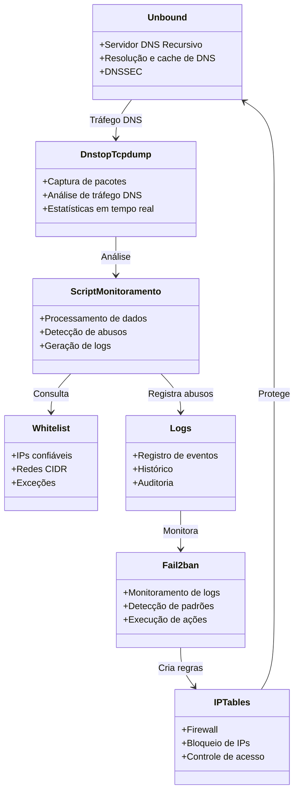
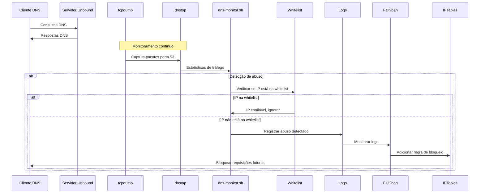
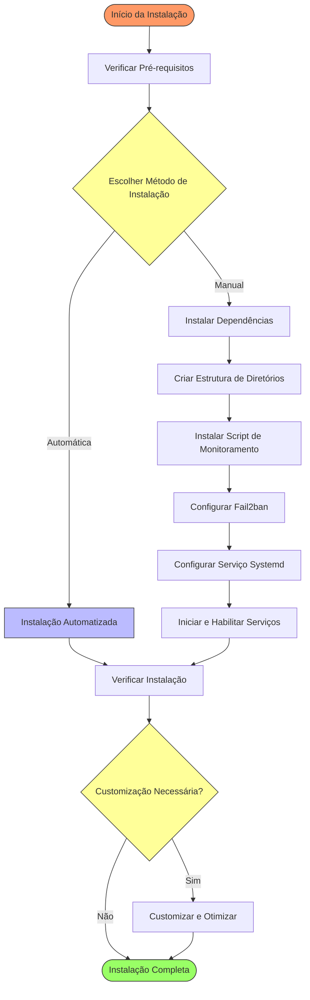
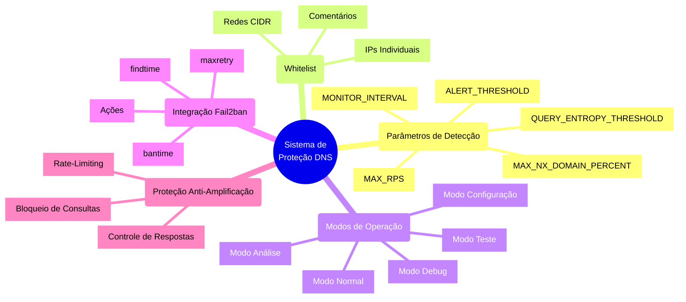
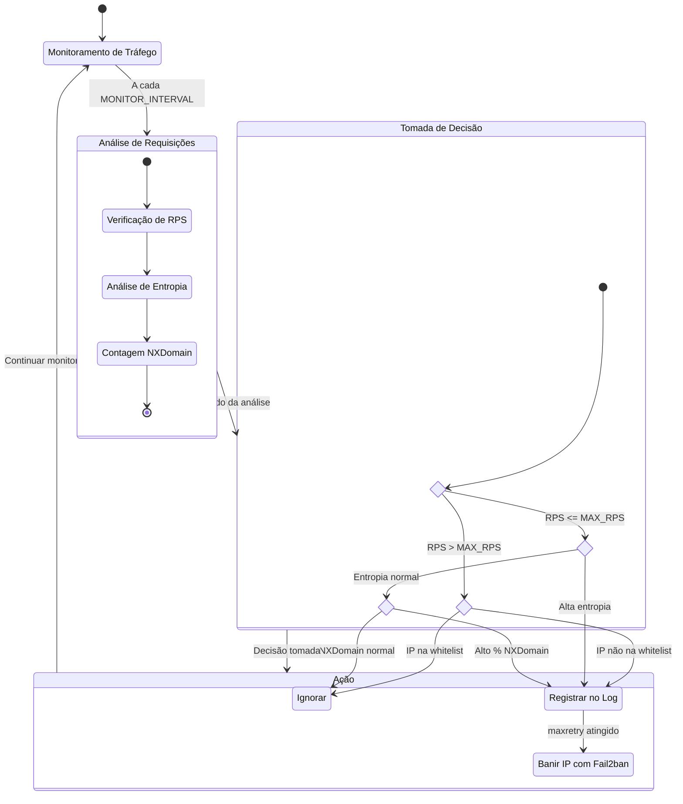
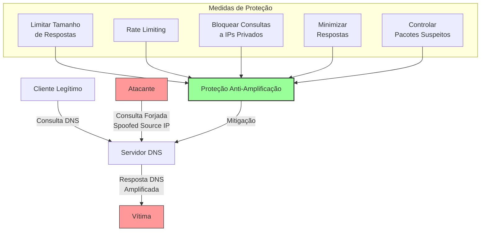

# Guia Técnico: Proteção de Servidores DNS Unbound contra Abusos

## 1. Visão Geral e Arquitetura da Solução

Este documento apresenta uma solução completa para proteção de servidores DNS Unbound contra ataques de negação de serviço (DoS) e uso abusivo do serviço. A solução implementa um sistema de monitoramento em tempo real usando **dnstop** para análise do tráfego DNS, com integração ao **Fail2ban** para banimento automático de IPs que excedam limites pré-definidos de requisições por segundo.

### 1.1. Componentes da Arquitetura



### 1.2. Fluxo de Operação



O fluxo completo de operação ocorre da seguinte forma:

1. O tráfego DNS na porta 53 (UDP/TCP) é capturado pelo tcpdump
2. Os pacotes capturados são analisados em tempo real pelo dnstop
3. Os IPs de origem são verificados contra a lista de IPs confiáveis
4. Análises avançadas são realizadas para detectar padrões de ataque (tunneling, alta taxa de NXDomain)
5. O script de análise processa a saída do dnstop e identifica IPs que excedem o limite de requisições
6. Os eventos de abuso são registrados em um arquivo de log específico
7. O Fail2ban monitora esse arquivo de log e aciona ações quando detecta padrões de abuso
8. O Fail2ban cria regras no iptables para bloquear o acesso dos IPs abusivos

## 2. Instalação e Configuração Detalhada



### 2.1. Pré-requisitos

- Sistema operacional Linux (Debian/Ubuntu recomendado)
- Unbound DNS Server já instalado e operacional
- Privilégios de administrador (root)
- Portas UDP/TCP 53 em uso pelo serviço DNS

### 2.2. Instalação Automatizada

Para uma instalação completa e automatizada, utilize o script de instalação fornecido:

```bash
# Tornar o script executável
chmod +x dns-protection-setup.sh

# Executar o script como root
sudo ./dns-protection-setup.sh
```

### 2.3. Instalação Manual (Passo a Passo)

Se preferir realizar a instalação manualmente, siga esses passos:

#### 2.3.1. Instalação de Dependências

```bash
# Atualizar os repositórios
sudo apt update

# Instalar dependências
sudo apt install -y dnstop tcpdump fail2ban bc
```

#### 2.3.2. Criação da Estrutura de Diretórios

```bash
# Diretório principal da solução (fixo)
DNS_PROTECTION_DIR="/opt/dns-protection"

# Criar diretórios para a solução
sudo mkdir -p $DNS_PROTECTION_DIR
sudo mkdir -p $DNS_PROTECTION_DIR/temp
sudo mkdir -p $DNS_PROTECTION_DIR/logs
sudo mkdir -p $DNS_PROTECTION_DIR/docs
```

#### 2.3.3. Instalação do Script de Monitoramento

Crie o script de monitoramento:

```bash
# Criar script de monitoramento
sudo nano /opt/dns-protection/dns-monitor.sh

# Copie o conteúdo do script fornecido na pasta docs/dns-protection
# [conteúdo do script aqui]

# Definir permissões de execução
sudo chmod +x /opt/dns-protection/dns-monitor.sh
```

#### 2.3.4. Configuração do Fail2ban

1. Criar o filtro Fail2ban para detecção de abusos:

```bash
# Criar filtro Fail2ban
sudo nano /etc/fail2ban/filter.d/dns-abuse.conf

# Insira o conteúdo:
[Definition]
_daemon = dns-monitor
failregex = ^.*ALERTA: Abuso de DNS detectado - IP=<HOST> RPS=.* - Excedeu limite de .* req/s$
ignoreregex =
```

2. Configurar a jail específica para proteção DNS:

```bash
# Criar configuração da jail
sudo nano /etc/fail2ban/jail.d/dns-abuse.conf

# Insira o conteúdo:
[dns-abuse]
enabled = true
filter = dns-abuse
logpath = /var/log/dns-abuse.log
maxretry = 2
findtime = 300
bantime = 3600
action = iptables-multiport[name=dns-abuse, port="53", protocol=udp]
         iptables-multiport[name=dns-abuse, port="53", protocol=tcp]
```

#### 2.3.5. Configuração do Serviço Systemd

Crie o arquivo de serviço para garantir que o monitoramento seja executado como um serviço gerenciado pelo systemd:

```bash
# Criar arquivo de serviço
sudo nano /etc/systemd/system/dns-protection.service

# Insira o conteúdo:
[Unit]
Description=Serviço de Proteção contra Abuso de DNS
After=network.target fail2ban.service

[Service]
Type=simple
ExecStart=/opt/dns-protection/dns-monitor.sh
Restart=on-failure
RestartSec=10
StandardOutput=syslog
StandardError=syslog
SyslogIdentifier=dns-protection

[Install]
WantedBy=multi-user.target
```

#### 2.3.6. Inicialização e Habilitação dos Serviços

```bash
# Criar arquivo de log vazio
sudo touch /var/log/dns-abuse.log

# Recarregar unidades systemd
sudo systemctl daemon-reload

# Reiniciar o Fail2ban para reconhecer as novas configurações
sudo systemctl restart fail2ban

# Habilitar e iniciar o serviço de proteção DNS
sudo systemctl enable dns-protection
sudo systemctl start dns-protection
```

## 3. Customização e Otimização



### 3.1. Análise Automática de Tráfego

A solução inclui um modo de análise que monitora o tráfego real por 5 minutos e sugere configurações otimizadas:

```bash
# Executar análise automática
sudo /opt/dns-protection/dns-monitor.sh --analyze
```

Este modo calcula estatísticas como:
- RPS máximo detectado
- RPS médio por cliente
- Total de consultas
- Total de IPs únicos

E sugere configurações ideais baseadas nessas métricas.

### 3.2. Configuração Interativa

Para simplificar o ajuste dos parâmetros sem editar arquivos manualmente:

```bash
# Executar modo de configuração interativa
sudo /opt/dns-protection/dns-monitor.sh --config
```

Este modo permite configurar interativamente:
- Limite de requisições por segundo (MAX_RPS)
- Intervalo de monitoramento
- Percentual de alerta (quando alertar antes de banir)
- Lista de IPs confiáveis

### 3.3. Gerenciamento de Whitelist e Rate Limiting

A solução agora inclui dois níveis de proteção:

#### 3.3.1. Whitelist: IPs Totalmente Confiáveis

```bash
# Editar a lista de IPs confiáveis (nunca serão bloqueados)
sudo nano /opt/dns-protection/config/whitelist.txt
```

O arquivo suporta:
- IPs individuais (ex: 192.168.1.10)
- Redes CIDR (ex: 10.0.0.0/8)
- Comentários (linhas começando com #)

Os IPs/redes listados neste arquivo nunca serão bloqueados, independentemente do volume de tráfego.

#### 3.3.2. Rate Limiting: IPs de Clientes Legítimos

```bash
# Editar a lista de IPs para rate limiting (nunca bloqueados, apenas limitados)
sudo nano /opt/dns-protection/config/rate_limited.txt
```

O arquivo segue o mesmo formato da whitelist e oferece:
- Proteção contra bloqueio total para clientes legítimos
- Aplicação automática de limites de tráfego quando necessário
- Sistema gradual que só aplica bloqueio após múltiplas violações

#### 3.3.3. Gerenciamento dos IPs em Rate Limiting

```bash
# Adicionar um IP à lista de rate limiting
sudo /opt/dns-protection/dns-monitor.sh --add-rate-limit IP_DO_CLIENTE

# Remover um IP da lista de rate limiting
sudo /opt/dns-protection/dns-monitor.sh --remove-rate-limit IP_DO_CLIENTE
```

#### 3.3.4. Visualização de IPs Banidos

Para verificar quais IPs estão atualmente banidos:

```bash
# Listar IPs banidos com informações detalhadas
sudo /opt/dns-protection/dns-monitor.sh --banned
```

Esta visualização fornece:
- Lista completa de IPs atualmente banidos
- Tempo restante do bloqueio
- Data/hora em que o IP foi banido
- Jail responsável pelo bloqueio

### 3.4. Ajuste de Limites de Requisições

O limite padrão agora é de 300 requisições por segundo. Para sistemas com diferentes perfis de carga, esse valor pode ser ajustado:

```bash
# Editar o script de monitoramento
sudo nano /opt/dns-protection/dns-monitor.sh

# Alterar o valor da variável MAX_RPS
# Por exemplo, para 500 requisições por segundo:
MAX_RPS=500
```

### 3.5. Detecção Avançada de Ataques



A solução inclui detecção de:

1. **Tunneling DNS**: Baseado na entropia das consultas DNS
   ```bash
   # Ajustar limiar de entropia
   QUERY_ENTROPY_THRESHOLD=4.0
   ```

2. **Ataques de NXDomain**: Monitorando percentual de consultas para domínios inexistentes
   ```bash
   # Ajustar percentual de alerta
   MAX_NX_DOMAIN_PERCENT=30
   ```

3. **Alerta precoce**: Emitir alertas quando um IP se aproxima do limite configurado
   ```bash
   # Percentual do limite para emitir alertas
   ALERT_THRESHOLD=80
   ```

### 3.6. Proteção Contra Ataques de Amplificação DNS



O servidor DNS Unbound inclui configurações específicas para prevenir seu uso em ataques de amplificação DNS:

1. **Limite de Tamanho das Respostas**
   ```bash
   # Limitar o tamanho máximo de respostas UDP
   max-udp-size: 3072
   ```
   Este parâmetro evita que grandes respostas sejam enviadas via UDP, reduzindo significativamente o potencial de ampliação.

2. **Rate Limiting por IP**
   ```bash
   # Limite de consultas por IP e global
   ip-ratelimit: 1000
   ip-ratelimit-size: 4m
   ip-ratelimit-slabs: 4
   ratelimit: 1000
   ```
   O rate limiting impede que endereços IP individuais façam um grande número de consultas em curto período, mitigando o uso do servidor como amplificador.

3. **Bloqueio de Consultas a Redes Privadas**
   ```bash
   # Bloquear queries recursivas para endereços privados
   private-address: 10.0.0.0/8
   private-address: 172.16.0.0/12
   private-address: 192.168.0.0/16
   private-address: 169.254.0.0/16
   private-address: fd00::/8
   private-address: fe80::/10
   ```
   Evita que o servidor seja usado para "escanear" redes internas ou responder a consultas sobre IPs privados.

4. **Respostas Mínimas**
   ```bash
   # Enviar apenas as informações solicitadas na resposta
   minimal-responses: yes
   ```
   Reduz o tamanho das respostas ao incluir apenas as informações explicitamente solicitadas pelo cliente.

5. **Detecção de Respostas Não Solicitadas**
   ```bash
   # Detectar e limitar respostas não solicitadas
   unwanted-reply-threshold: 10000
   ```
   Este parâmetro ajuda a detectar e mitigar ataques que envolvem envio de respostas não solicitadas.

6. **Zonas Locais para Consultas Frequentemente Abusadas**
   ```bash
   # Bloquear consultas específicas frequentemente usadas em ataques
   local-zone: "1.0.0.127.in-addr.arpa." nodefault
   local-zone: "localhost." nodefault
   local-zone: "onion." refuse
   ```
   Estas configurações bloqueiam ou limitam consultas a zonas específicas frequentemente utilizadas em ataques.

### 3.7. Verificação da Proteção Contra Amplificação

Para verificar se a proteção contra amplificação está funcionando corretamente:

```bash
# Verificar configurações de proteção contra amplificação
unbound-control list_conf | grep -E '(ratelimit|private-address|minimal-responses|max-udp-size)'

# Testar potencial de amplificação (simulação segura)
dig @localhost +dnssec +bufsize=4096 ANY isc.org | wc -c
```

Para um servidor corretamente configurado, este último comando deverá retornar uma resposta menor ou limitada ao tamanho configurado em `max-udp-size`.

## 4. Monitoramento e Verificação

### 4.1. Verificação do Status do Serviço

```bash
# Verificar status do serviço de proteção
sudo systemctl status dns-protection

# Verificar status do Fail2ban
sudo fail2ban-client status dns-abuse
```

### 4.2. Monitoramento de Logs

```bash
# Visualizar logs de abuso em tempo real
sudo tail -f /var/log/dns-abuse.log

# Verificar ações do Fail2ban
sudo tail -f /var/log/fail2ban.log
```

### 4.3. Teste do Sistema de Proteção

Para testar o sistema sem efetivamente banir IPs:

```bash
# Executar o script em modo de teste
sudo /opt/dns-protection/dns-monitor.sh --test --once
```

### 4.4. Verificação de IPs Banidos

```bash
# Listar IPs atualmente banidos pelo Fail2ban
sudo fail2ban-client status dns-abuse

# Verificar regras iptables criadas
sudo iptables -L -n | grep -i dns-abuse
```

## 5. Solução de Problemas

```mermaid
flowchart TD
    start([Problema Detectado]) --> type{Tipo de Problema}
    
    type -->|Serviço não inicia| checks1[Verificações Iniciais]
    checks1 --> c1[Verificar permissões]
    c1 --> c2[Verificar dependências]
    c2 --> c3[Verificar interface de rede]
    c3 --> fixed1{Resolvido?}
    fixed1 -->|Sim| end([Problema Resolvido])
    fixed1 -->|Não| logs1[Verificar logs do sistema]
    logs1 --> support[Contatar Suporte]
    
    type -->|Fail2ban não bane IPs| f1[Verificar filtro]
    f1 --> f2[Verificar logs do Fail2ban]
    f2 --> f3[Reiniciar serviços]
    f3 --> fixed2{Resolvido?}
    fixed2 -->|Sim| end
    fixed2 -->|Não| conf[Verificar configuração]
    conf --> support
    
    type -->|Alto uso de CPU| cpu1[Aumentar intervalo]
    cpu1 --> cpu2[Limitar captura de pacotes]
    cpu2 --> fixed3{Resolvido?}
    fixed3 -->|Sim| end
    fixed3 -->|Não| analyze[Executar análise de tráfego]
    analyze --> support
    
    type -->|Falsos positivos| fp1[Aumentar limite RPS]
    fp1 --> fp2[Adicionar IPs à whitelist]
    fp2 --> fp3[Aumentar maxretry]
    fp3 --> fixed4{Resolvido?}
    fixed4 -->|Sim| end
    fixed4 -->|Não| advanced[Configurações avançadas]
    advanced --> support
    
    style start fill:#f96,stroke:#333,stroke-width:2px
    style end fill:#9f6,stroke:#333,stroke-width:2px
    style type fill:#ff9,stroke:#333,stroke-width:2px
```

### 5.1. O Serviço de Monitoramento Falha ao Iniciar

**Possíveis causas e soluções:**

1. **Permissões**: Verifique se o script tem permissões de execução:
   ```bash
   sudo chmod +x /opt/dns-protection/dns-monitor.sh
   ```

2. **Dependências**: Certifique-se de que todas as dependências estão instaladas:
   ```bash
   sudo apt install -y dnstop tcpdump bc grep awk
   ```

3. **Interface de rede incorreta**: O script tenta detectar automaticamente a interface de rede. Se estiver incorreta:
   ```bash
   # Editar o script para definir manualmente a interface
   sudo nano /opt/dns-protection/dns-monitor.sh
   
   # Substituir a linha de detecção automática por:
   NETWORK_INTERFACE="eth0"  # Use o nome correto da sua interface
   ```

### 5.2. O Fail2ban Não Está Banindo IPs

**Possíveis causas e soluções:**

1. **Filtro incorreto**: Verifique se o filtro está reconhecendo corretamente as entradas no log:
   ```bash
   sudo fail2ban-regex /var/log/dns-abuse.log /etc/fail2ban/filter.d/dns-abuse.conf
   ```

2. **Problema com as ações**: Verifique os logs do Fail2ban:
   ```bash
   sudo tail -f /var/log/fail2ban.log
   ```

3. **Reinício necessário**: Reinicie o Fail2ban após modificações:
   ```bash
   sudo systemctl restart fail2ban
   ```

### 5.3. Alto Consumo de CPU pelo dnstop

**Possíveis soluções:**

1. **Aumentar intervalo de monitoramento**:
   ```bash
   # Editar o script
   sudo nano /opt/dns-protection/dns-monitor.sh
   
   # Aumentar o valor de MONITOR_INTERVAL para 120 ou mais
   ```

2. **Limitar a captura a tipos específicos de pacotes**:
   ```bash
   # Modificar o filtro tcpdump para capturar menos pacotes
   DNS_PORT="port 53 and udp and not (src net 127.0.0.0/8)"
   ```

### 5.4. Falsos Positivos (IPs Legítimos Sendo Banidos)

**Possíveis soluções:**

1. **Aumentar o limite de requisições por segundo**:
   ```bash
   # Editar o script
   sudo nano /opt/dns-protection/dns-monitor.sh
   
   # Aumentar MAX_RPS para um valor mais apropriado
   ```

2. **Adicionar IPs à lista de ignorados**:
   ```bash
   sudo nano /etc/fail2ban/jail.d/dns-abuse.conf
   
   # Adicionar ou modificar a linha ignoreip
   ignoreip = 127.0.0.1/8 10.0.0.0/8 192.168.0.0/16 IP_A_IGNORAR
   ```

3. **Aumentar o número de retentativas antes do banimento**:
   ```bash
   sudo nano /etc/fail2ban/jail.d/dns-abuse.conf
   
   # Aumentar maxretry
   maxretry = 5
   ```

## 6. Manutenção e Boas Práticas

### 6.1. Atualização Periódica

```bash
# Atualizar pacotes regularmente
sudo apt update && sudo apt upgrade -y
```

### 6.2. Verificação Regular dos Logs

Implemente um processo regular de análise de logs para identificar padrões e ajustar configurações:

```bash
# Resumo diário de IPs banidos
grep "Ban " /var/log/fail2ban.log | grep "dns-abuse" | awk '{print $NF}' | sort | uniq -c | sort -nr
```

### 6.3. Backup das Configurações

```bash
# Definir diretório de backup
BACKUP_DIR="/root/backups/dns-protection-$(date +%Y%m%d)"
mkdir -p $BACKUP_DIR

# Backup periódico das configurações
sudo cp -r /opt/dns-protection $BACKUP_DIR/
sudo cp /etc/fail2ban/filter.d/dns-abuse.conf $BACKUP_DIR/
sudo cp /etc/fail2ban/jail.d/dns-abuse.conf $BACKUP_DIR/
```

### 6.4. Monitoramento Periódico

Realize periodicamente a análise do tráfego para verificar se os limites ainda são adequados:

```bash
# Analisar tráfego atual e receber recomendações
sudo /opt/dns-protection/dns-monitor.sh --analyze
```

### 6.5. Atualização da Whitelist

Mantenha sua lista de IPs confiáveis atualizada, removendo IPs que não são mais relevantes e adicionando novos IPs confiáveis:

```bash
# Editar a whitelist
sudo nano /opt/dns-protection/config/whitelist.txt
```

## 7. Informações Adicionais

### 7.1. Arquivos Principais

- **Script principal**: `/opt/dns-protection/dns-monitor.sh`
- **Whitelist**: `/opt/dns-protection/config/whitelist.txt`
- **Arquivos temporários**: `/opt/dns-protection/temp/`
- **Filtro Fail2ban**: `/etc/fail2ban/filter.d/dns-abuse.conf`
- **Configuração da jail**: `/etc/fail2ban/jail.d/dns-abuse.conf`
- **Arquivo de log**: `/var/log/dns-abuse.log`
- **Serviço systemd**: `/etc/systemd/system/dns-protection.service`
- **Documentação**: `/opt/dns-protection/docs/`

### 7.2. Comandos Úteis

```bash
# Ver estatísticas de tráfego DNS em tempo real
sudo dnstop -l 10 $(ip route | grep default | sed -e "s/^.*dev.//" -e "s/.proto.*//")

# Liberar um IP banido pelo Fail2ban
sudo fail2ban-client set dns-abuse unbanip IP_ADDRESS

# Recarregar configuração do Fail2ban sem reiniciar
sudo fail2ban-client reload dns-abuse

# Executar monitoramento no modo de teste (não bane IPs)
sudo /opt/dns-protection/dns-monitor.sh --test --once

# Executar em modo debug com informações adicionais
sudo /opt/dns-protection/dns-monitor.sh --debug --once
```

### 7.3. Recursos e Referências

- [Documentação oficial do dnstop](https://github.com/measurement-factory/dnstop)
- [Documentação oficial do Fail2ban](https://www.fail2ban.org/wiki/index.php/Main_Page)
- [Documentação oficial do Unbound](https://nlnetlabs.nl/documentation/unbound/)